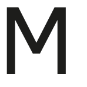

# ioBroker.motionblinds

**Tests:** 

## motionblinds adapter for ioBroker

Controls blind motors from MotionBlinds.

Needed Components:
- Motionblinds bridge CMD-01
- MotionBlinds motor
- Smartphone

Usage:
- Install original MotionBlinds app on your smartphone
- Create an account and add your bride
- Pair your motor to your bridge
- [Retrieve the key of your bridge](https://github.com/jhurliman/node-motionblinds#retrieving-your-key)
- Enter your key in the adaper configuration

Troubleshooting:
This adapter uses UDP unicast and UDP multicast, ensure your firewall is not blocking that traffic.
- Multicast IP: 238.0.0.18
- UDP ports: 32101 and 32100

## Changelog
<!--
	Placeholder for the next version (at the beginning of the line):
	### **WORK IN PROGRESS**
-->
### 0.2.0 (2022-03-25)
* (Vben) added timeout support
* (VBen) fixed warnings during new state creation
* (VBen) updated dependencies

### 0.1.1 (2022-01-13)
* (VBen) updated dependencies

### 0.0.2-beta.0 (2021-08-25)
* (Vben) initial release

## License
MIT License

Permission is hereby granted, free of charge, to any person obtaining a copy
of this software and associated documentation files (the "Software"), to deal
in the Software without restriction, including without limitation the rights
to use, copy, modify, merge, publish, distribute, sublicense, and/or sell
copies of the Software, and to permit persons to whom the Software is
furnished to do so, subject to the following conditions:

The above copyright notice and this permission notice shall be included in all
copies or substantial portions of the Software.

THE SOFTWARE IS PROVIDED "AS IS", WITHOUT WARRANTY OF ANY KIND, EXPRESS OR
IMPLIED, INCLUDING BUT NOT LIMITED TO THE WARRANTIES OF MERCHANTABILITY,
FITNESS FOR A PARTICULAR PURPOSE AND NONINFRINGEMENT. IN NO EVENT SHALL THE
AUTHORS OR COPYRIGHT HOLDERS BE LIABLE FOR ANY CLAIM, DAMAGES OR OTHER
LIABILITY, WHETHER IN AN ACTION OF CONTRACT, TORT OR OTHERWISE, ARISING FROM,
OUT OF OR IN CONNECTION WITH THE SOFTWARE OR THE USE OR OTHER DEALINGS IN THE
SOFTWARE.

Copyright (c) 2022 Vben <devel@velmeden.info>